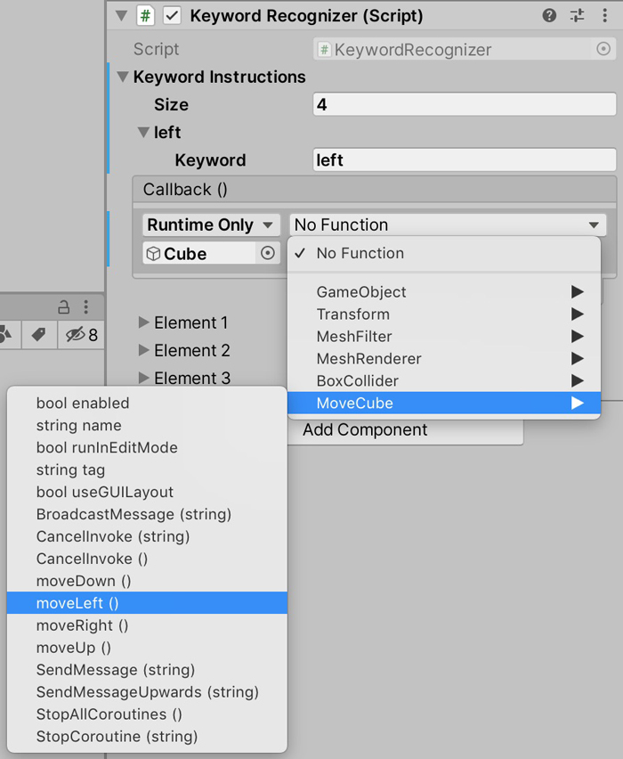
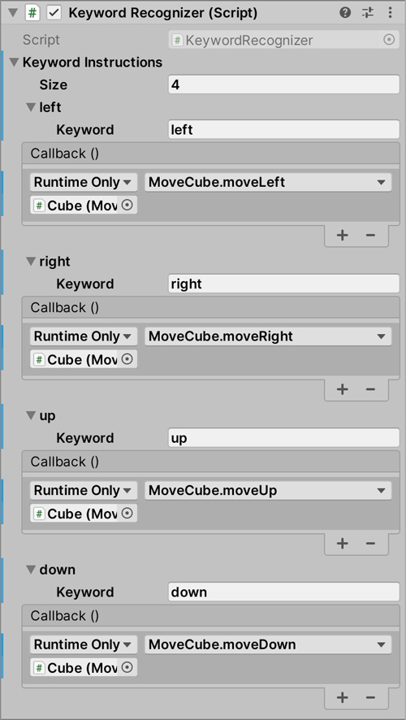

# Keyword Recognizer for Unity on macOS

1. Introduction
2. Installation Example
3. Recompiling plug-in bundle
4. ToDos for improvement

## Introduction

This project provides an asset for keyword recognition to be used in Unity. It uses the speech recognition provided by macOS. The asset consists of a C# script that should be attached to only one (!) object per scene and a binary plug-in bundle written in Objective-C that enables to use particular functions of the [NSSpeechRecognizer class](https://developer.apple.com/documentation/appkit/nsspeechrecognizer) from within Unity.  
Keywords can be easily defined from within the Unity editor using the respective *Inspector* field of the component to which the C# script is attached. It simply requires to define a keyword and a callback event being triggered after recognition. This is described in the following section *Installation Example*. The recognition seems to be somewhat slow. On a MacBook Pro, 2.3 GHz Intel Core i7, 16 GB 1600 MHz DDR3, it takes about 1 to 1.5 seconds to detect a defined keyword.

## Installation Example

1. Import the KeywordRecognizer package to your Unity project:  
   

2. Drag the imported KeywordRecognizer prefab from the Assets folder of your *Project* window to your scene.  
  
In the Inspector field of the prefab you should see the KeywordRecognizer script.  

3. Open the *Keywords* section and define the size of keywords.  
  
In this example we use the four keywords *left*, *right*, *up* and *down* to move an object. Therefore the size is four.

4. Now open the section of each element (keyword). Type your keyword in the *Keyword* field. Define an event that will be triggered if the keyword is recognized. To do this, drag the object to which the script defining your event belongs into the object field of the *Call Back ()* section. In the example shown, an object named *Cube* has been dragged into the field. A script named *MoveCube* has already been added to *Cube*. The script contains actions like *moveLeft()* or *moveRight()*. Select whatever the script of your object provides. In this example, we use the function *moveLeft()* for the keyword *left*.  
  
   
In our example we repeat this for all keywords.
  

5. If you run the scene, the KeywordRecognizer starts. Usually, a microphone icon appears to indicate the keywords that have been recognized.
  

6. After importing the KeywordRecognizer package you can find this example in your Assets directory under *Example/Scenes/ExampleScene*.

## Recompiling plug-in bundle

The bundle was compiled for macOS 10.12 or higher on i386 x86_64 architectures using the Apple LLVM 8.1 compiler. If you want to use it on another architecture you need to recompile the bundle using Xcode. The Objective-C files are attached to the *Xcode* directory.

## ToDos for improvement

The bundle written on Objective-C uses the [Automatic Reference Counting (ARC)](https://developer.apple.com/library/archive/releasenotes/ObjectiveC/RN-TransitioningToARC/Introduction/Introduction.html#//apple_ref/doc/uid/TP40011226) for memory management. However it is unknown what happens if you feed an extremely high amount of keywords into the system. Furthermore it would be a big step to speed up the recognition process, but probably this is limited by the performance of the NSSpeechRecognizer class.
